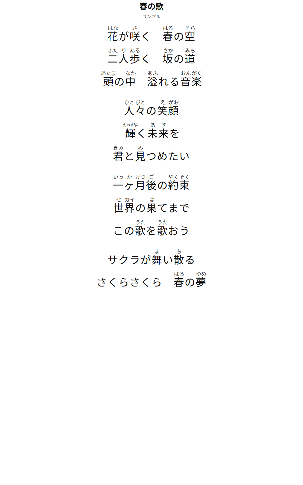

# Lyrics Furigana（歌词注音）

给日语歌词加上**按歌曲实际演唱发音**的逐字假名注音（类似拼音标注），并渲染成适合打印/浏览的 PDF 与 HTML 歌词单。

> English: A Codex skill that annotates Japanese song lyrics with per-character kana readings matching how each word is *actually sung*, and renders print-ready PDF/HTML lyrics sheets.

## 特性

- **原文原样、注音在上**：正文保留原字体原大小，注音以较小假名显示在每个汉字正上方、逐字精确居中（HTML ruby + 无头 Chrome/Edge 渲染，零额外依赖）。
- **按歌曲实际唱法注音**，而不是词典默认读音：例如 頭 唱成「あたま」就标 あたま；未来 唱成「あす」就标 未[あ]来[す]；世界 唱成「セカイ」就标 世[セ]界[カイ]。
- **五十音不注**：平假名、片假名与标点原样显示；送り仮名（如 咲く 的「く」）保持原文。
- **自带校验**：漏标汉字、注音标到假名上、注音含非假名都会警告，方便自查。

## 效果预览



## 安装（Codex 用户）

把整个文件夹复制到：

- Windows: `C:\Users\<你>\.codex\skills\lyrics-furigana`
- macOS/Linux: `~/.codex/skills/lyrics-furigana`

Codex 会自动发现该技能。之后只需说：

> 用 $lyrics-furigana 把这首歌的歌词做成带注音的 PDF：<歌词或歌名>

## 手动使用

1. 准备一个 UTF-8 文本文件，用方括号 `[读音]` 紧跟汉字，给出**逐字**注音：

```
#title: 春の歌
#artist: サンプル

花[はな]が咲[さ]く　春[はる]の空[そら]
頭[あたま]の中[なか]
二[ふた]人[り]歩[ある]く
```

2. 渲染：

```
python scripts/render_ruby_pdf.py 歌词.txt
```

生成同名 `.pdf` 和 `.html`。常用选项：

| 选项 | 说明 | 默认 |
|---|---|---|
| `--font-size 30pt` | 正文字号 | `26pt` |
| `--rt-scale 0.45` | 注音相对正文字号比例 | `0.5` |
| `--preview out.png` | 输出预览图用于检查 | - |
| `--html-only` | 只生成 HTML | - |
| `--browser <path>` | 指定 Chrome/Edge | 自动检测 |
| `--margin "18mm 16mm"` | 页边距 | `20mm 18mm` |

也可以在文件头部用 `#font-size:`、`#rt-scale:`、`#letter-spacing:`、`#page-size:`、`#margin:` 等指令设置。

## 读音规则（要点）

- **以实际演唱发音为准**；同形字取决于歌曲（頭→あたま/どう/ず…）。
- 多字词**逐字拆分**：約束 → 約[やく]束[そく]；二人 → 二[ふた]人[り]；音楽 → 音[おん]楽[がく]。
- 送り仮名不注：咲く → 咲[さ]く；輝く → 輝[かがや]く。
- 々 重复前字读音：人々 → 人[ひと]々[びと]。
- ヶ/ヵ 按语境：一ヶ月 → 一[いっ]ヶ[か]月[げつ]。
- 当て字/义训按唱法：世界 唱成 セカイ → 世[セ]界[カイ]。
- 完整规则见 [`references/reading-rules.md`](references/reading-rules.md)。

## 环境要求

- Python 3（标准库即可，无需 pip 安装任何包）
- 渲染 PDF 需要本机 Chrome 或 Edge（自动检测；可设环境变量 `LYRICS_BROWSER` 或 `--browser` 指定）
- 在受限沙箱中运行无头浏览器可能需用户授权一次；`--html-only` 始终可用

## License

[MIT](LICENSE)